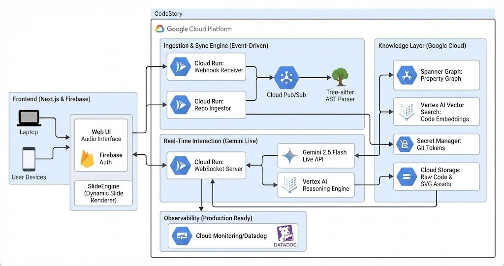

# CodeStory — Real-Time Multimodal Narrative Interface for Codebase Intelligence

<p align="center">
  
</p>

> **Built for the Gemini Live API Hackathon — Creative Story Track**

CodeStory transforms any GitHub repository into a **live, voice-narrated, visually-rich architecture walkthrough** powered by Google's Gemini 2.5 Flash Live API. Paste a repo URL → AI narrates the code → real-time slides and diagrams appear — all while you can interrupt and ask questions.

---

## ✨ Features

| Feature | Description |
|--------|-------------|
| 🎙️ **Live Voice Narration** | Gemini 2.5 Flash Live API with native audio (no STT→LLM→TTS lag) |
| 📊 **Real-Time Slides** | AI generates slides & Mermaid diagrams mid-narration |
| 🧠 **Spanner Graph RAG** | Multi-hop GQL traversals reveal hidden code relationships |
| 💬 **Interrupt Anytime** | Barge-in detection — ask a question, the AI pivots instantly |
| 🎭 **Three Personas** | Architect, Debugger, or Historian narration style |
| 🔁 **Session Resumption** | 2-hour resumable sessions with context compression |

---

## 🏗️ Architecture

```
Browser (Next.js)
    │   WebSocket (PCM 16kHz audio)
    ▼
WebSocket Server (FastAPI, Cloud Run)
    │   Google GenAI SDK
    ▼
Gemini 2.5 Flash Live API ──── Function Calls ──► Reasoning Engine
    │                                                    │
    ▼                                                    ▼
Audio Response (24kHz)                          Spanner Graph (GQL)
    │                                           Vertex AI Embeddings
    ▼
Slide Engine (Next.js) ← render_slide / generate_mermaid_flow tool calls
```

---

## 🚀 Quick Start

### 1. Prerequisites

- Node.js 20+
- Python 3.11+
- GCP Project with Spanner, Vertex AI, Cloud Run APIs enabled
- Service account JSON key

### 2. Clone & Configure

```bash
git clone https://github.com/Shivyoddha/Gemini_Live_API_Hackathon_CodeStory
cd Gemini_Live_API_Hackathon_CodeStory
cp .env.example .env
# Edit .env with your credentials
mkdir -p secrets
# Place your GCP service account JSON at secrets/gcp-key.json
```

### 3. Set Up Spanner Graph Schema

```bash
# Run the schema creation script against your Spanner instance
gcloud spanner databases ddl update cymbal \
  --instance=cloud-codestory \
  --project=gemini-live-api-hackathon \
  --ddl-file=infrastructure/spanner_schema.sql
```

### 4. Run with Docker Compose

```bash
docker-compose up --build
```

Then open [http://localhost:3000](http://localhost:3000).

### 5. Run Services Individually (Dev Mode)

```bash
# Terminal 1 — Frontend
cd frontend && npm install && npm run dev

# Terminal 2 — WebSocket Server
cd backend/websocket_server
pip install -r requirements.txt
uvicorn main:app --port 8000 --reload

# Terminal 3 — Ingestion Service
cd backend/ingestion_service
pip install -r requirements.txt
uvicorn main:app --port 8001 --reload
```

---

## 📁 Project Structure

```
├── frontend/                    # Next.js 14 app
│   ├── app/
│   │   ├── page.tsx            # Landing page
│   │   └── session/[id]/       # Live session page
│   └── components/
│       ├── slide/              # SlideEngine, MermaidViewer
│       ├── audio/              # AudioInterface
│       └── ui/                 # TranscriptPanel, IngestionProgress
├── backend/
│   ├── websocket_server/       # FastAPI + Gemini Live API bridge
│   │   ├── main.py            # WebSocket server
│   │   └── tools/             # slide_tools, spanner_client, session_store
│   └── ingestion_service/      # Repo ingestion pipeline
│       ├── main.py            # FastAPI ingestion API
│       └── parsers/           # ast_parser, embedder, spanner_hydrator
├── infrastructure/
│   └── spanner_schema.sql      # Spanner Graph DDL schema
├── docker-compose.yml
└── .env
```

---

## 🎭 Session Modes

1. **Architecture Walkthrough** — AI starts from entry points and narrates the entire system
2. **Flow-Based Explanation** — Trace a specific flow (auth, payment, API request) with sequence diagrams
3. **Immersive Q&A** — Open conversation with an AI that knows your entire codebase

---

## 🔧 GCP Services Used

| Service | Purpose |
|---------|---------|
| Gemini 2.5 Flash Live API | Real-time multimodal AI narration |
| Spanner Graph | Property graph knowledge base (GQL traversals) |
| Vertex AI Embeddings | Semantic code embeddings (textembedding-gecko@003) |
| Cloud Run | Serverless compute for all services |
| Cloud Storage | Raw code and SVG asset storage |
| Cloud Pub/Sub | Async ingestion event triggers |
| Secret Manager | Secure credential storage |

---

## 🏆 Hackathon Track

**Creative Story Track** — Gemini Live API Hackathon

CodeStory embodies the "story" metaphor: your codebase is the protagonist, the AI is the narrator, and every session is a unique journey through the architecture.

---

*Built with ❤️ by Team CodeStory*
