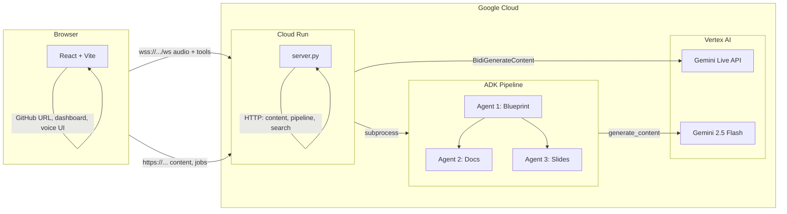

# CodeStory

**Turn any GitHub repo into an interactive, voice-narrated code walkthrough.**

CodeStory clones a repository, generates structured documentation and presentation slides, then lets you explore them with a **Gemini Live API**–powered voice assistant. Ask questions, jump between slides, and get answers grounded in your docs—all through natural conversation.


---

## What CodeStory Does

1. **Paste a GitHub URL** — CodeStory clones the repo and runs a pipeline to generate:
   - **Documentation** — Markdown docs per topic (architecture, APIs, data models, etc.).
   - **Slides** — Module-based slide decks for each section.
2. **Dashboard** — Browse modules and slides, open per-module documentation (with Mermaid diagram support).
3. **Voice assistant** — Connect to Gemini Live; the agent explains slides, answers questions using the docs, and can switch slides or search documentation on demand.
4. **Transcript & Chat** — See the conversation in the side panel; type follow-up questions or rely on voice.

| Feature | Description |
|--------|-------------|
| **Live voice narration** | Gemini 2.5 Flash Live API speaks slide content in real time. |
| **Slide-based walkthrough** | Documentation and slides generated from the repo; the AI explains slide-by-slide. |
| **Interrupt anytime** | Barge-in: ask a question mid-explanation; the agent answers then continues. |
| **RAG over docs** | For large codebases, the agent can call `search_documentation` to pull details from ChromaDB. |
| **Transcript & video** | At the end of a module you can download the Q&A transcript or the screen recording. |

---

## Architecture



**Flow:** The React app sends voice and tool calls over WebSocket to the backend (deployed on Cloud Run). The backend proxies to **Vertex AI Gemini Live API** for real-time narration and runs the **ADK pipeline** (three agents: blueprint → docs + slides) when the user submits a repo. Pipeline output is served via the HTTP Content API.

---

## Quick Start

**Prerequisites:** Node.js 18+, Python 3.10+, [Google Cloud project](https://console.cloud.google.com/) with Vertex AI / Gemini API enabled.

```bash
# 1. Clone this repo
git clone https://github.com/Shivyoddha/Gemini_Live_API_Hackathon_CodeStory.git
cd Gemini_Live_API_Hackathon_CodeStory

# 2. Backend (from project root)
python -m venv .venv
source .venv/bin/activate   # or .venv\Scripts\activate on Windows
pip install -r app/requirements.txt
pip install -r pipeline/requirements.txt
# Optional: pip install chromadb   for doc search
gcloud auth application-default login

# 3. Start the server (WebSocket proxy + Content API)
cd app && python server.py
# Leave running. You should see: WebSocket ws://localhost:8080, HTTP http://localhost:8081

# 4. Frontend (new terminal)
cd app
npm install
npm run dev
# Open http://localhost:5173
```

- **First screen:** Enter a GitHub repo URL (or use **Dev mode** to skip the pipeline and go straight to the dashboard with existing `documentation/` and `slides/`).
- **Dashboard:** Pick a module, use ▶ to start a voice walkthrough, or 📄 to open that module’s documentation.
- **Connect:** Click **Connect** in the navbar and allow microphone access to talk to the agent.

---

## Documentation

| Doc | Description |
|-----|-------------|
| [Onboarding](readme-docs/01-onboarding.md) | Who CodeStory is for, concepts, and first-run flow. |
| [Setup](readme-docs/02-setup.md) | Prerequisites, environment, optional ChromaDB, and running server + frontend. |
| [Architecture](readme-docs/03-architecture.md) | Repo layout, pipeline, Content API, and Gemini Live integration. |
| [Code reference](readme-docs/04-code-reference.md) | Main components, APIs, and tools (switch_slide, search_docs, download_content). |
| [Troubleshooting](readme-docs/05-troubleshooting.md) | Common issues, ports, and logs. |
| [GCP & Cloud Run](readme-docs/06-gcp-cloud-run.md) | How to deploy the backend to Google Cloud Run and connect the app. |

---

## Project layout

```
├── README.md                 ← You are here
├── readme-docs/              ← Detailed docs (onboarding, setup, architecture, code, troubleshooting)
├── app/                      ← CodeStory UI + server (WebSocket proxy, Content API, pipeline launcher)
├── pipeline/                 ← Pipeline: clone repo → generate docs + slides (ADK agents)
├── documentation/            ← Generated or hand-written Markdown docs (per module)
├── slides/                   ← Generated or hand-written slides (per module)
└── logo.png
```

---

## Deploy to Google Cloud

CodeStory’s backend can run on **Cloud Run** so the project meets the hackathon requirement that the backend is deployed on Google Cloud.

**Quick deploy** (from project root):

```bash
gcloud auth login
gcloud auth application-default login
gcloud config set project YOUR_PROJECT_ID
gcloud services enable aiplatform.googleapis.com run.googleapis.com cloudbuild.googleapis.com

gcloud run deploy codestory-backend \
  --source . \
  --region us-central1 \
  --allow-unauthenticated \
  --set-env-vars "GOOGLE_CLOUD_PROJECT=YOUR_PROJECT_ID"
```

After deploy, set the frontend to use the service URL: in `app` create `.env` with `VITE_API_BASE=https://YOUR_SERVICE_URL`, then in the app set **Proxy WebSocket URL** to `wss://YOUR_SERVICE_URL/ws` and run `npm run dev`.

**Full guide:** [GCP & Cloud Run](readme-docs/06-gcp-cloud-run.md) — enabling APIs, auth, connecting the frontend, and troubleshooting.

**Automated deploy:** A GitHub Actions workflow (`.github/workflows/deploy-cloudrun.yml`) deploys to Cloud Run on push to `main` or on manual run. Add repo secrets `GCP_SA_KEY` and `GCP_PROJECT_ID` as described in the [GCP guide](readme-docs/06-gcp-cloud-run.md) (section 4a).

---

## Hackathon compliance (Creative Storyteller)

- **Gemini model:** We use **Vertex AI Gemini Live API** for real-time voice and **Gemini 2.5 Flash** for the docs/slides pipeline.
- **Agents (ADK):** Our content-generation **agents** are built with **Google ADK** (Agent Development Kit): three agents in `pipeline` (blueprint, codebase doc, slide workflow). The real-time voice experience uses the **Vertex AI Gemini Live API**.
- **Google Cloud:** Backend is deployable on **Cloud Run**; we use **Vertex AI** for Gemini. See [Deploy to Google Cloud](#deploy-to-google-cloud) above.

---

## Proof of Google Cloud deployment

For submission you can either (1) upload a short screen recording of the Cloud Run service and logs in the Google Cloud Console, or (2) point to these code locations that use Google Cloud / Vertex AI:

| What | File and purpose |
|------|------------------|
| Vertex Live API (client) | [app/src/utils/gemini-api.js](app/src/utils/gemini-api.js) — `apiHost`, `serviceUrl` for `us-central1-aiplatform.googleapis.com` |
| WebSocket proxy + auth | [app/server.py](app/server.py) — connects to Vertex AI, uses `google.auth` |
| ADK agents | [pipeline/common.py](pipeline/common.py) (Runner, SessionService), [pipeline/blueprint_agent.py](pipeline/blueprint_agent.py) (Agent) |

---

## Tech stack

- **Frontend:** React 19, Vite 7, react-markdown, Mermaid, react-icons
- **Backend:** Python 3 (HTTP server + WebSocket proxy), Google Auth, ChromaDB (optional, for doc search)
- **Voice:** Google Vertex AI Gemini Live API (real-time bidirectional audio)
- **Pipeline:** ADK agents (Gemini 2.5 Flash) for documentation and slide generation
- **Architecture diagram:** [README](#architecture) (Mermaid); exportable version in [docs/architecture.md](docs/architecture.md)

---

## License

See repository license file.
