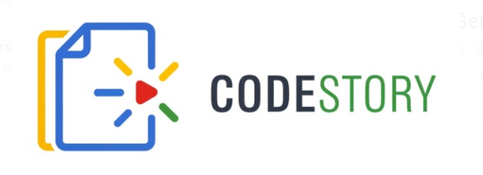

# CodeStory

**Turn any GitHub repo into an interactive, voice-narrated code walkthrough.**

CodeStory clones a repository, generates structured documentation and presentation slides, then lets you explore them with a **Gemini Live API**–powered voice assistant. Ask questions, jump between slides, and get answers grounded in your docs—all through natural conversation.



---

## The Experience

Experience your code like never before. CodeStory uses advanced agentic workflows to analyze your codebase and transform it into a professional presentation.

- **Real-time Voice Narration**: Gemini Live API provides a fluid, conversational walkthrough of your project.
- **Agentic Documentation**: Three specialized agents (Blueprint, Doc, and Slide) work together to understand your code.
- **Interactive Interruption**: Ask questions at any point. The assistant pauses, explains complex logic using RAG over your docs, and resumes the flow.

---

## Architecture


---

## Resilience & Error Handling

CodeStory is built to handle the unpredictability of AI agents and distributed systems.


-   **Transient Error Recovery**: AI requests automatically retry up to 3 times with exponential backoff on `429` (Rate Limit) and `5xx` (Server) errors.
-   **Log Instrumentation**: If a pipeline stage fails, the backend captures the last 50 lines of logs to provide detailed diagnostic context in the UI.
-   **Network Fault Tolerance**: The frontend progress tracker ignores up to 3 consecutive polling failures before alerting the user, preventing flickering on minor network blips.

---

## Quick Start - Local setup

Experience CodeStory in minutes by following these three steps.

### 1. Project Configuration

CodeStory uses two specialized configuration files to manage secure credentials and runtime connectivity.

#### A. Pipeline Configuration (`pipeline/.env`)
This file powers the agentic orchestration. Create it in the `pipeline/` directory:
```env
# Required: Authentication for Gemini and ADK agents
GOOGLE_API_KEY=your_gemini_api_key_here
```

#### B. App & Frontend Configuration (`app/.env`)
This file configures the web interface and backend storage. Create it in the `app/` directory:
```env
# Frontend: Points to your backend (Local: http://localhost:8081 | Prod: Cloud Run URL)
VITE_API_BASE=http://localhost:8081
VITE_PROJECT_ID=your-gcp-project-id

# Backend (Optional): Enable cloud persistence
GCS_BUCKET=your-unique-gcs-bucket-name
GOOGLE_CLOUD_PROJECT=your-gcp-project-id
GEMINI_API_KEY=your_gemini_api_key_here
```

### 2. Launching the App

Once configured, simply run the production script to spin up the interface.

- **Windows**:
  ```powershell
  .\scripts\run-prod.bat
  ```
- **macOS / Linux**:
  ```bash
  ./scripts/run-prod.sh
  ```

---

## Deployment to Google Cloud

CodeStory is designed to be deployed as a containerized service on **Cloud Run**.

1.  **Infrastructure Setup**:
    - Enable Vertex AI, Cloud Run, Cloud Build, and Firestore APIs.
    - Create a GCS bucket for content persistence.
2.  **Deploy Backend**:
    ```bash
    gcloud run deploy codestory-backend \
      --source . \
      --region us-central1 \
      --allow-unauthenticated \
      --set-env-vars "GOOGLE_CLOUD_PROJECT=YOUR_PROJECT_ID,GCS_BUCKET=your-bucket-name"
    ```
3.  **Connect Frontend**: Update `VITE_API_BASE` in your frontend `.env` to point to the Cloud Run URL.

---

## User Interaction Guide

Follow these steps to experience the full CodeStory workflow:

1.  **Submit a Repository**: Enter a public GitHub URL (e.g., `https://github.com/Shivyoddha/Traveller`) on the landing page and click **Generate Walkthrough**.
2.  **Autonomous Analysis**: The system will automatically run the analysis, documentation, and slide generation agents. Wait for the status to reach **"done"**.
3.  **Interactive Walkthrough**: Click **Connect** in the navbar to authorize your microphone, then click the **Play** button on any module to start the Gemini Live narration.
4.  **Barge-In**: Interrupt the agent at any time with questions about the code. It uses RAG over the generated docs to provide grounded, real-time answers.

---

## Tech Stack

- **Intelligence**: Vertex AI Gemini 2.5 Flash, Gemini Live API
- **Agents**: Google ADK (Agent Development Kit)
- **Frontend**: React 19, Vite, Mermaid.js
- **Backend**: Python 3.10+, Nginx, WebSockets
- **Cloud**: Google Cloud Run, GCS, Firestore

---