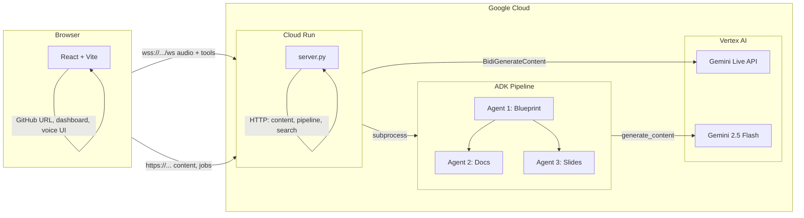

# CodeStory Architecture (Hackathon)

This diagram shows how Gemini and the backend connect for judges. Export as PNG for Devpost (e.g. use [Mermaid Live](https://mermaid.live) or your IDE).

- **Browser:** React app (GitHub URL, dashboard, voice UI, transcript).
- **Cloud Run:** Backend (server.py) — WebSocket proxy to Vertex, HTTP Content API, pipeline launcher.
- **Vertex AI:** Gemini Live API (real-time voice), Gemini 2.5 Flash (pipeline).
- **ADK Pipeline:** Three agents (blueprint → docs + slides) built with Google ADK.
