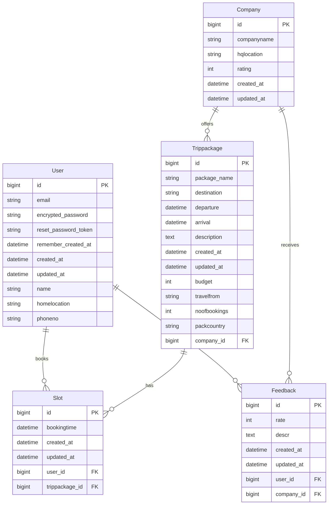

# Data Model & Relationships
The core data models within the Traveller application include `User`, `Company`, `Trippackage`, `Slot`, and `Feedback`. These models are designed to capture essential information for travel planning, booking, and review processes, and are interconnected through well-defined relationships.

## Core Models and Attributes

| Model       | Attributes                                                                                                  | Description                                                                                             |
| :---------- | :---------------------------------------------------------------------------------------------------------- | :------------------------------------------------------------------------------------------------------ |
| `User`      | `id`, `email`, `encrypted_password`, `reset_password_token`, `remember_created_at`, `created_at`, `updated_at`, `name`, `homelocation`, `phoneno` | Represents application users, handling authentication and storing personal contact/location details.    |
| `Company`   | `id`, `companyname`, `hqlocation`, `rating`, `created_at`, `updated_at`                                     | Represents travel companies, including their name, headquarters, and a rating.                          |
| `Trippackage` | `id`, `package_name`, `destination`, `departure`, `arrival`, `description`, `budget`, `travelfrom`, `noofbookings`, `packcountry`, `created_at`, `updated_at`, `company_id` | Details of a travel package, including its name, destination, dates, budget, description, and associated company. |
| `Slot`      | `id`, `bookingtime`, `created_at`, `updated_at`, `user_id`, `trippackage_id`                                | Represents a user's booking for a specific travel package at a specific time.                           |
| `Feedback`  | `id`, `rate`, `descr`, `created_at`, `updated_at`, `user_id`, `company_id`                                  | Stores user feedback, including a rating and a textual description, linked to a user and a company.     |

## Entity-Relationship Diagram

