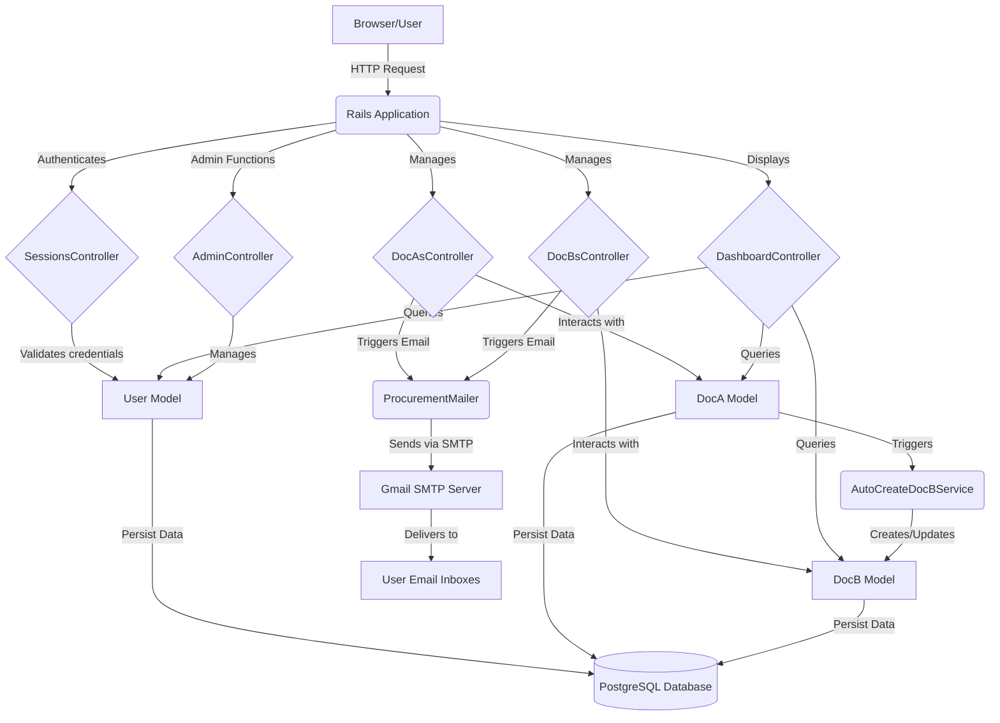

## System Architecture

The IRIS Procurement Portal is built on a standard Ruby on Rails 7.0 framework, adhering to the Model-View-Controller (MVC) architectural pattern. It leverages PostgreSQL as its primary data store and `bcrypt` for secure user authentication. The system is designed for modularity and maintainability, with clear separation of concerns across its components.

### Core Components:

*   **Models (`app/models/`)**:
    *   `User`: Manages user authentication, roles (Buyer 'U', Approvers 'P', 'Q', 'R', 'S', Admin), and their associations with procurement documents. Uses `has_secure_password` for password hashing.
    *   `DocA`: Represents the first procurement document. Manages its attributes (equipment ID, name, cost, head), timestamps/remarks for each approval stage, and an enumerated `status` for workflow progression.
    *   `DocB`: Represents the second procurement document. Automatically generated upon `DocA` approval, inheriting key data. Follows a similar approval structure to `DocA`.
    *   `ApplicationRecord`: Base class for all models.

*   **Views (`app/views/`)**:
    *   ERB (Embedded Ruby) templates render the user interface. This includes forms for document creation, detailed document views, and dashboards.
    *   Utilizes inline CSS for styling and responsiveness, visible in `app/views/layouts/application.html.erb` and `app/views/sessions/new.html.erb`.

*   **Controllers (`app/controllers/`)**:
    *   `ApplicationController`: Base controller, handles common functionalities like user authentication (`authenticate_user`) and admin access checks (`check_admin_access`).
    *   `SessionsController`: Manages user login and logout processes.
    *   `DashboardController`: Displays a personalized overview for each user, including pending approvals and their document history.
    *   `DocAsController`: Handles CRUD operations for Document A and manages its approval/rejection logic, including email triggers. Includes `generate_next_eq_id` for unique equipment IDs.
    *   `DocBsController`: Handles CRUD for Document B, its approval/rejection logic, and email triggers. Also includes `generate_next_eq_id`.
    *   `AdminController`: Provides basic user management functionalities for administrators, such as editing user display names, emails, and passwords.

*   **Services (`app/services/`)**:
    *   `AutoCreateDocBService`: A dedicated service object responsible for the automated creation of `DocB` instances once `DocA` receives final approval. This ensures separation of business logic from controllers.

*   **Mailers (`app/mailers/`)**:
    *   `ApplicationMailer`: Base mailer, sets default `from` address using `ENV['GMAIL_USERNAME']`.
    *   `ProcurementMailer`: Contains specific logic for sending email notifications for various document status changes (submission, approval, rejection) to relevant users.

### Technology Stack:

| Category        | Technology / Gem      | Purpose                                                       | Evidence                                                    |
| :-------------- | :-------------------- | :------------------------------------------------------------ | :---------------------------------------------------------- |
| **Web Framework** | Ruby on Rails 7.0     | Core application framework.                                   | `Gemfile`, `config/application.rb`                          |
| **Ruby Version**  | 3.2.0                 | Required Ruby runtime.                                        | `Gemfile`, `Dockerfile`                                     |
| **Database**      | PostgreSQL            | Primary relational database.                                  | `db/schema.rb` (enables `plpgsql`), `INSTALL_SUMMARY.md`    |
| **ORM**           | ActiveRecord          | Rails' object-relational mapping.                             | All models (`app/models/`)                                  |
| **Web Server**    | Puma 6.0              | HTTP web server for Rails applications.                       | `Gemfile`, `config/puma.rb`, `Procfile`                     |
| **Authentication**| bcrypt 3.1.7          | Secure password hashing and authentication.                   | `Gemfile`, `app/models/user.rb` (`has_secure_password`)     |
| **Frontend**      | ERB, HTML, CSS        | Templating engine and styling.                                | `app/views/`, `app/assets/stylesheets/application.css`      |
| **Asset Mgmt**    | Importmap-Rails       | Modern JavaScript dependency management.                      | `Gemfile`, `lib/tasks/assets.rake`                          |
| **Async Tasks**   | Active Job (inline)   | For potentially background tasks like email sending. Configured inline in `production.rb`. | `config/environments/production.rb`                         |
| **Containerization**| Docker, Docker Compose | Development and deployment environment consistency.           | `Dockerfile`, `docker-compose.yml`, `DOCKER_SETUP.md`       |
| **Email SMTP**    | Gmail SMTP            | External service for sending emails.                          | `config/environments/*.rb`, `app/mailers/procurement_mailer.rb` |
| **Debugging**     | Debug, Web-Console    | Development-time debugging tools.                             | `Gemfile` (development group)                               |

### System Interaction Diagram:

