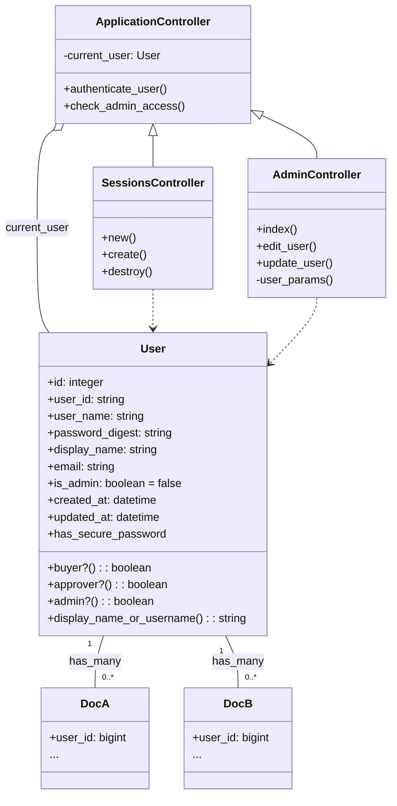

## User and Role Management

The system incorporates a robust user and role management system to control access and define responsibilities within the procurement workflow.

### User Roles:

The application defines distinct roles, primarily identified by the `user_name` field for workflow participants and an `is_admin` flag for administrative access:

*   **Buyer (`U`)**:
    *   Initiates `DocA` and `DocB` documents.
    *   Tracks the status of their submitted documents.
    *   Receives email notifications for document status changes (approved, rejected).
*   **Approvers (`P`, `Q`, `R`, `S`)**:
    *   Review documents assigned to them in the sequential workflow.
    *   Can `approve` or `reject` documents, adding remarks.
    *   Receive email notifications for new documents awaiting their approval.
*   **Administrator (`admin`)**:
    *   Manages user accounts, including display name, email, and password changes.
    *   Accesses the `/admin` route.
    *   `is_admin` boolean flag in the `User` model denotes administrative privileges. The default 'admin' user is also recognized.

### Authentication:

*   **Mechanism**: Session-based authentication. Upon successful login, the `user_id` is stored in the `session`.
*   **Secure Passwords**: The `User` model uses `has_secure_password` provided by the `bcrypt` gem to securely hash and store user passwords. This prevents plaintext password storage.
*   **Login/Logout**: Handled by `SessionsController`. Users log in via a dedicated `/login` page and can log out via a `DELETE /logout` action.
*   **Access Control**:
    *   `ApplicationController` includes a `before_action :authenticate_user` to ensure all actions (except login/logout) require an authenticated user.
    *   `check_admin_access` `before_action` is triggered for routes under `/admin`, ensuring only users with `admin?` privileges can access them.

### User Management Features (for Administrators):

The `AdminController` provides a basic interface for user management:

*   **List Users**: Displays all registered users with their `user_name`, `display_name`, `email`, role, and admin status (`/admin`).
*   **Edit User**: Allows administrators to modify a user's `display_name`, `email`, and `password` (`/admin/users/:id/edit`).
*   **Password Change**: When editing a user, the password fields can be left blank if no change is desired. Otherwise, `password` and `password_confirmation` are used to update the password securely.

### Test User Credentials (from `db/seeds.rb`, `INSTALL_SUMMARY.md`, `app/views/sessions/new.html.erb`):

| Username | Display Name   | Email                      | Password    | Role        |
| :------- | :------------- | :------------------------- | :---------- | :---------- |
| `admin`  | Administrator  | `admin@gmail.com`          | `123456`    | Administrator |
| `U`      | Buyer          | `anish.kumbhar04@gmail.com`| `U123`      | Buyer       |
| `P`      | Approver P     | `brc@nitk.edu.in`          | `P123`      | Approver    |
| `Q`      | Approver Q     | `brc@nitk.edu.in`          | `Q123`      | Approver    |
| `R`      | Approver R     | `brc@nitk.edu.in`          | `R123`      | Approver    |
| `S`      | Approver S     | `brc@nitk.edu.in`          | `S123`      | Approver    |

### Class Diagram: User and Authentication

