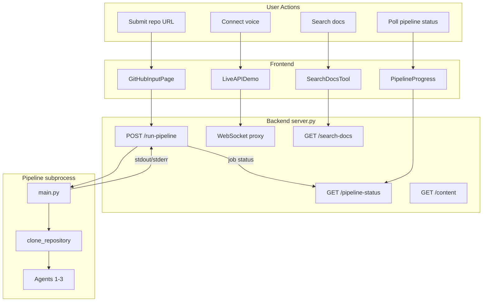
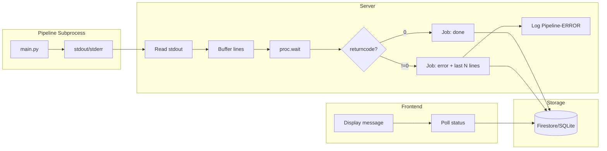

# CodeStory — Error Logging

How errors flow through the application, where to find them, and how to fix common failures.

---

## Overview

CodeStory captures and surfaces errors at multiple layers:

- **Pipeline** — Subprocess runs `main.py`; stdout/stderr is buffered and stored in the job when it fails.
- **Backend** — Structured `[Component] [LEVEL]` logs; job status stores error details; WebSocket sends `ERROR` frames before closing.
- **Frontend** — Pipeline progress shows full error output; content fetch offers a Retry; SearchDocsTool surfaces fetch failures; WebSocket parses `ERROR` frames.

---

## Error Flow Architecture

---

## Pipeline Error Flow

When the pipeline exits with a non-zero code, the server captures the last 50 lines of output and stores them in the job:

---

## Component Error Table

| Component | Error sources | Where it surfaces | User sees |
|-----------|---------------|-------------------|-----------|
| **Pipeline** | API keys, git clone, blueprint parse, agent rate limits | Job status `message`; server log `[Pipeline-ERROR]` | PipelineProgress scrollable error + Copy button |
| **Backend** | GCS, Firestore, ChromaDB, HTTP validation | `print` with `[Component] [LEVEL]`; `_send_json(4xx/5xx)` | HTTP error body; GitHubInputPage `setError` |
| **WebSocket proxy** | Auth, timeout, upstream connection, invalid JSON | `_send_ws_error_and_close` sends `{type:"ERROR",message}` frame | LiveAPIDemo `setDebugInfo`; `onErrorMessage` |
| **GitHubInputPage** | Validation, POST /run-pipeline 4xx/5xx | `data.error` | Red error text under input |
| **PipelineProgress** | Poll 404/500, job status="error" | `message` from job; poll failure after 3 attempts | Full error output; "Could not reach server" |
| **LiveAPIDemo** | Content fetch, WebSocket connect, SearchDocsTool | `contentStatus`, `setDebugInfo`, `addMessage` | "Failed to load content. Retry"; system messages |
| **SearchDocsTool** | GET /search-docs failure | `onResult(query, [], error)` | `[Search failed: …]` in chat |

---

## Where to Look for Logs

| Environment | Where | What |
|-------------|-------|------|
| **Local** | Terminal where `server.py` runs | `[Pipeline]`, `[Pipeline-ERROR]`, `[GCS]`, `[ChromaDB]`, `[Firestore]`, `[HTTP]` |
| **Cloud Run** | Google Cloud Console → Cloud Run → your service → **Logs** | Same tags; filter by `Pipeline` or `ERROR` to find failures |
| **Browser** | DevTools → Console | `console.warn`, `console.error` from frontend; WebSocket close events |
| **Job status** | `GET /pipeline-status/<jobId>` | `status`, `message` (includes last 50 lines of pipeline output on error) |

---

## Error Message Catalogue

| Message | Cause | Fix |
|---------|-------|-----|
| `GEMINI_API_KEY or GOOGLE_API_KEY not found` | Pipeline `.env` missing or Cloud Run env not set | Add to `.env` locally; set `GEMINI_API_KEY` in Cloud Run deploy |
| `Pipeline exited with code 1` | Pipeline failed (see `message` for details) | Check job status `message`; common causes: missing API key, git not in container, network |
| `Git clone failed` | `git` not installed or repo inaccessible | Install `git` in Dockerfile; ensure GitHub is reachable |
| `Could not reach server` | Polling `/pipeline-status` failed (404/500) | Ensure backend is running; check `VITE_API_BASE` / `CODESTORY_PROD_URL` |
| `Authentication failed` | Access token generation failed | Run `gcloud auth application-default login` |
| `Service URL is required` | Client did not send `service_url` | Check Configuration in UI; ensure proxy URL is set |
| `Upstream connection failed` | Cannot connect to Gemini API | Verify Vertex AI is enabled; check project and region |
| `[Search failed: ...]` | `/search-docs` returned error or network failure | Ensure ChromaDB is installed; content indexed; backend reachable |
| `Failed to load content` | `GET /content` failed | Use Retry button; check session_id; ensure pipeline has run |

---

## Troubleshooting Pipeline Errors

1. **Check the job status** — The frontend shows the full error when the pipeline fails. Use **Copy error** to share or paste into logs.
2. **Read the last output** — The server stores up to 50 lines of pipeline stdout/stderr. Look for `ValueError`, `RuntimeError`, or tracebacks.
3. **Run locally** — `cd pipeline && python main.py --url <repo> --choice 3` to see full output and tracebacks.
4. **Cloud Run** — Ensure `GEMINI_API_KEY` (or `GOOGLE_API_KEY`) and `git` are available. See [GCP & Cloud Run](06-gcp-cloud-run.md).

---

Next: [Troubleshooting](05-troubleshooting.md) | Back: [Code reference](04-code-reference.md)
